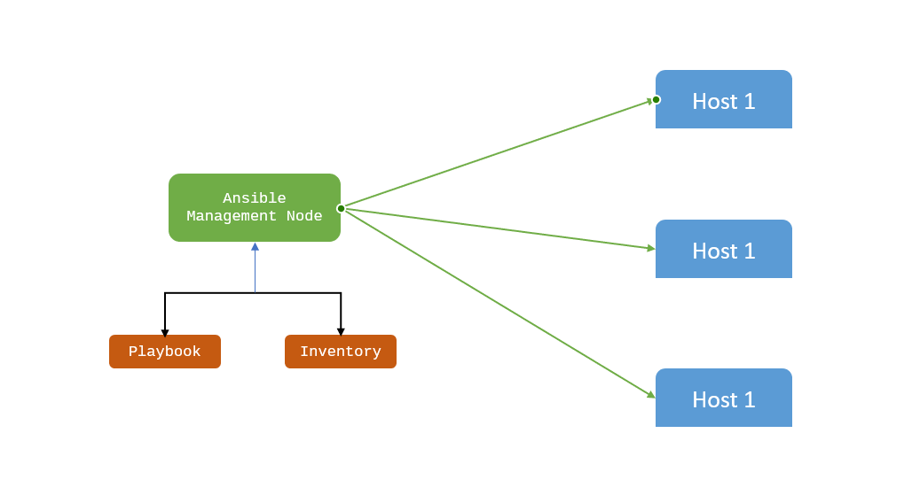

# Getting-Started-with-Ansible
Objectives: Automate system administration tasks on managed hosts with Ansible.  Learn how to write Ansible playbooks to standardize task execution.

## Installing Ansible
 For now ansible is not supporting windows OS, so we are using the linux system for ansdible.
 ### Installation steps are given follow for linux system (UBUNTU)
 Debian/Ubuntu:
    The easiest way to install Ansible on a Debian or Ubuntu system is to use the official apt package.
* $ sudo apt-add-repository -y ppa:ansible/ansible
* $ sudo apt-get update
* $ sudo apt-get install -y ansible
* If you get an error like “sudo: add-apt-repository: command not found”, you’re probably missing the python-software-properties package. Install it with the command:
* $ sudo apt-get install python-software-properties

Once Ansible is installed, make sure it’s working properly by entering ansible --version on the
command line. You should see the currently-installed version:

$ ansible --version

## Ansible Workflow

## Terms	Explanation

| Terms | Explanation |
| :---: | :---: 
| Ansible Server |	It is a machine where Ansible is installed and from which all tasks and playbooks will be executed. 
| Modules |	The module is a command or set of similar commands which is executed on the client-side. 
| Task	| A task is a section which consists of a single procedure to be completed.
| Role | It is a way of organizing tasks and related files to be later called in a playbook.
| Fact | The information fetched from the client system from the global variables with the gather facts operation.
| Inventory | A file containing the data regarding the Ansible client-server.
| Play | It is the execution of the playbook.
| Handler | The task is called only if a notifier is present.
| Notifier | The section attributed to a task which calls a handler if the output is changed.
| Tag | It is a name set to a task that can be used later on to issue just that specific task or group of jobs.
